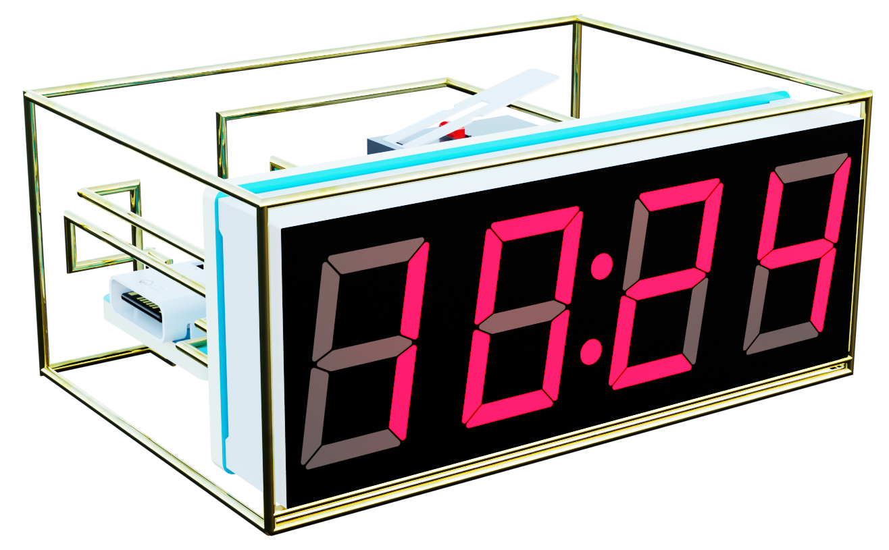
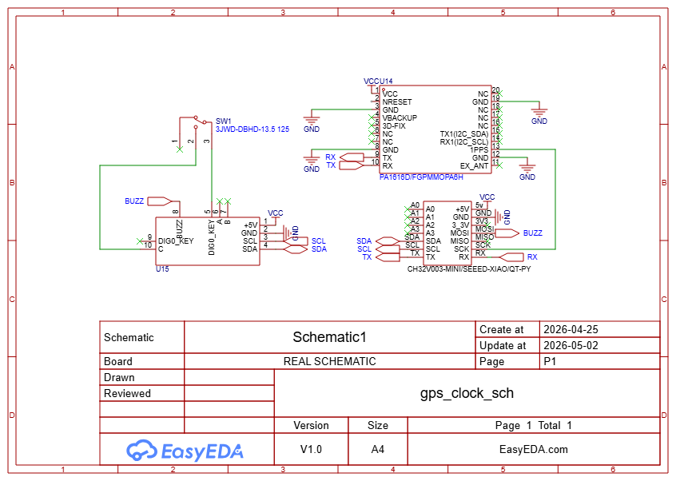
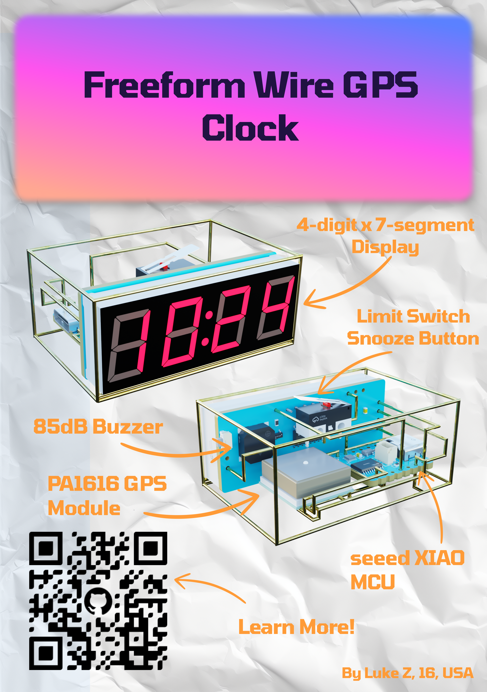

# Freeform Wire Precision GPS Alarm Clock

## What is this?
This is a precision alarm clock that utilizes GPS to keep atomically accurate time. It is artistically constructed using freeform bent wire and can be used with any seeed-studio XIAO form factor microcontroller along with a PA1616 GPS module.
## Why did I make this?
I've recently been inspired by [Mohit Bhoite's](https://bhoite.com/sculptures/) wire sculptures and wanted to make something of my own. I also recently finished my ultra-cheap [CH32V003 dev board](https://github.com/Pasqalup/CH32v003-MINI) that I made specifically for this type of project. I thought it'd be nice to make a functional and artistic alarm clock.
## Features
- Atomically accurate GPS timekeeping using PA1616 GPS module
- 4x7 segment clock display
- Simple 2-button interface for setting the alarm
- Limit switch snooze button
- 85dB 2.7khz buzzer for alarm sound
- CH455 I/O expander for controlling the display and reading buttons
## How to make it
- Conslidated display + buttons + buzzer PCB using the CH455 I/O expander (see [CH455-PCB](./pcb/CH455-PCB/README.md) for details)
- [PDF assembly templates](./gps%20clock%20wiring%20template.pdf) for freeform wire bending
- [Assembly guide](./ASSEMBLY.md) for step-by-step instructions on how to put everything together
## Code/Firmware
See my dedicated [GitHub repository](https://github.com/Pasqalup/ch32_gps_clock) for firmware specifically for my CH32V003 board. It should be possible to port to other XIAO form factor boards with some work.
## Bill of Materials
| Part | Quantity | Link | Notes |
| --- | --- | --- | --- |
| PA1616 GPS Module | 1 | [Adafruit](https://www.adafruit.com/product/5186) | 
| Limit switch | 1 | [LCSC](https://www.lcsc.com/product-detail/C2906291.html) | Order with the CH455 module |
| 20AWG Brass Wire | 1 | [AliExpress](https://www.aliexpress.us/item/3256806093878315.html) | 0.8mm 10m. (about 20AWG) Or you can choose your own similar gauge or copper wire.
| CH455 display/button Module | 1 | [Here](./CH455-PCB/README.md) | You must order and assemble this PCB yourself, see the linked README for instructions |
| Your choice of Seeed Studio XIAO microcontroller | 1 | [My CH32V003 Board](https://github.com/Pasqalup/CH32v003-MINI) | I only have code for my own CH32V003 board, but it should be possible to port to other XIAO form factor boards with some work. |
## Full Schematic

## Fallout Zine
