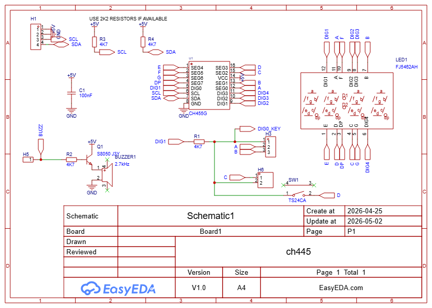

# CH455 PCB Module
This is the part that actually has the display, buttons, and buzzer on it. Through I2C, it can write to the 4x7 display while simultaneously reading all the buttons. There is a seperate pin for the buzzer, which is controlled through an NPN transistor.
## Bill of Materials
| Part | Quantity | Link | Notes |
| --- | --- | --- | --- |
| WCH CH455G | 5 (MOQ) | [LCSC](https://www.lcsc.com/product-detail/C89818.html) |
| 4x7 Segment Clock Display | 1 | [LCSC - RED](https://www.lcsc.com/product-detail/C46908.html) | Not sure if other colors are available |
| Buzzer | 5 (MOQ) | [LCSC](https://www.lcsc.com/product-detail/C49246949.html) | 2.7kHz 85dB |
| S8050 J3Y NPN Transistor | 50 (MOQ) | [LCSC](https://www.lcsc.com/product-detail/C916392.html) | 
| Mini side button | 20 (MOQ) | [LCSC](https://www.lcsc.com/product-detail/C393942.html) |
| 4.7k Resistor | 100 (MOQ) | [LCSC](https://www.lcsc.com/product-detail/C2907166.html) | 4 per design - 1 for buttons, 1 for buzzer, 2 for i2c pullups (optional - buy seperate 2.2k resistors for pullups) |
| 100nF Capacitor | 20 (MOQ) | [LCSC](https://www.lcsc.com/product-detail/C24452.html) | |

## Schematic
